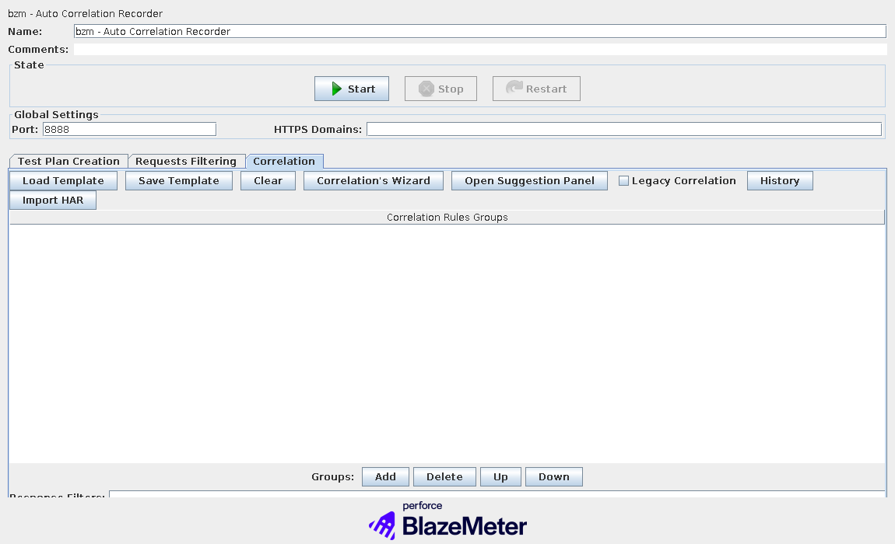
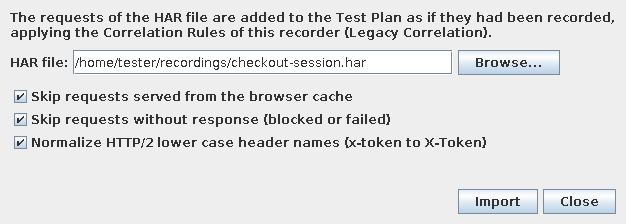

# Auto Correlations Recorder Plugin for JMeter


Welcome to the Auto Correlation Recorder's JMeter Plugin, the main and extensive documentation can be seen in [this link](https://blazemeter.github.io/CorrelationRecorder/).

## Usage

You can either use the plugin to [automatically correlate your dynamic variables](https://blazemeter.github.io/CorrelationRecorder/guide/#correlating-dynamic-variables) while recording in JMeter or, you can [implement your own logic for your particular case.](https://blazemeter.github.io/CorrelationRecorder/custom-extensions/)

## Import a HAR file instead of recording (fork addition)

This fork adds the possibility of applying your Correlation Rules to a **HAR file** exported from
the browser, without recording through the proxy. The requests of the HAR are added to the Test
Plan exactly as the recorder would add them (same samplers, Header Managers, timers and grouping),
and your rules are applied while they are added, so you get the same extractors and
`${variable}` replacements as in a live recording.

Only the rules you configure are used: no automatic correlation, no replay and no suggestions are
triggered. The legacy correlation engine is always enabled during the import, so you don't need to
tick *Legacy Correlation* first.

### From the JMeter GUI

1. Select your `bzm - Auto Correlation Recorder`, open the **Correlation** tab and load or write
   the rules you want to apply.
2. Make sure the Test Plan has a **Recording Controller** (or a Thread Group) to store the
   requests, as when recording.
3. Click **Import HAR**, choose the file and press **Import**.





When it finishes, a report shows how many requests were imported or skipped and **how many times
each rule was applied**, which makes it easy to spot a rule that does not match the HAR:

```text
HAR import finished: /home/tester/recordings/checkout-session.har
  Entries in HAR: 3
  Imported as samplers: 3
  Excluded by recorder URL/content type filters: 0
  Skipped: 0
  Failed to convert: 0

Correlation rules (1 of 1 applied):
  - [Login] csrf: extracted 1 time(s), replaced 2 time(s)
```

Options in the dialog:

| Option | Default | Description |
| --- | --- | --- |
| Skip requests served from the browser cache | on | Entries flagged by the browser as served from its cache never reached the server, so the recorder would not have captured them. |
| Skip requests without response | on | Entries with status `0` (blocked, cancelled or failed in the browser). |
| Normalize HTTP/2 lower case header names | on | Browsers export HTTP/2 headers in lower case (`x-csrf-token`). This converts them to the usual form (`X-Csrf-Token`) so rules written against recordings keep matching. Header names that already contain upper case characters are left untouched. |

Requests with a scheme other than `http`/`https` (`data:`, `ws:`, `wss:`, `blob:`) are skipped,
since JMeter HTTP samplers can't reproduce them.

### Without GUI (command line)

```bash
cd $JMETER_HOME
java -cp "lib/ext/*:lib/*:bin/ApacheJMeter.jar" \
  com.blazemeter.jmeter.correlation.core.har.HarCorrelationCli \
  plan.jmx recording.har result.jmx
```

Where `plan.jmx` is a Test Plan containing the recorder with your rules (just save it from the
GUI) and a Recording Controller or Thread Group. Optional flags: `--keep-cached`,
`--keep-without-response`, `--no-header-normalization`. The exit code is `2` when no request could
be imported.

### Installing the jar manually

Copy `jmeter-bzm-correlation-recorder-<version>.jar` into `$JMETER_HOME/lib/ext`. As in the
upstream plugin, its dependencies are not bundled, so `$JMETER_HOME/lib` also needs
`jmeter-bzm-commons`, `json`, `json-path`, `json-smart`, `maven-artifact` and the `xmlunit`
jars (installing the plugin with the JMeter Plugins Manager resolves them for you).

## Contributing

Got **something interesting** you'd like to **share**? Learn about [contributing](https://blazemeter.github.io/CorrelationRecorder/contributing/).

## License

Apache License 2.0

```text
A permissive license whose main conditions require preservation of copyright and license notices. 
Contributors provide an express grant of patent rights. Licensed works, modifications, and larger 
works may be distributed under different terms and without source code.
```

To know more about it, read the license [here](LICENSE)

## Credits

All the awesome icons we are using come from [Material.io](https://material.io/). If you like them, please check them out.
